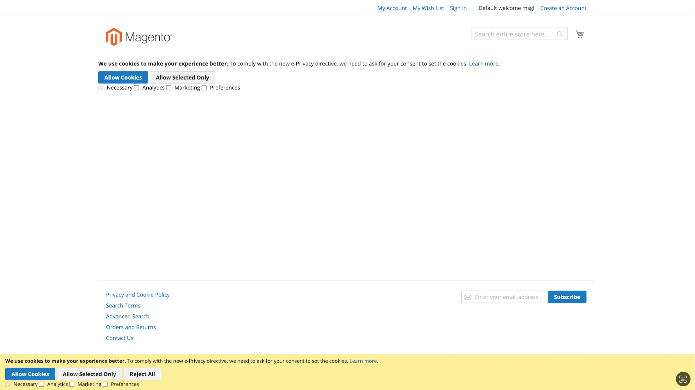

# Magento 2 GTM Consent Mode v2 Extension

The Collab_ConsentMode module extends native Magento_Cookie module in following ways:

- if Collab_ConsentMode is enabled and Cookie Restriction Mode is set to "Yes" native consent popup is extended with 
additional checkboxes (for user preferences) and additional buttons which will let them save theirs preferences.

The Collab_ConsentMode module works in following way:

- by default (when user visitis the page for the first time) we are presenting the user with the consent popup
- on initial visit gtag is fired with following options, those options are saved in the local storage
```javascript
gtag('consent', 'default', {
    'ad_storage': 'denied',
    'ad_user_data': 'denied',
    'ad_personalization': 'denied',
    'analytics_storage': 'denied'
})
```
Please mind that this initialization needs to be done as soon as possible (at least before GTM script is fired) 
so we are loading gtag's template (block name `consent.initializer`) in `head.additional` block with `before="-"` 
argument. If Your project is using customized layout please make sure that `consent.initializer` is first block in 
Yours `head.additional` block or it is placed at least before GTM init script.
- if user changes his preferences, we are firing gtag with new options and saving them in the local storage
- if user visits the page again, we are checking if there are any preferences saved in the local storage and if so 
we are just using them
- user has an ability to change his preferences at any time by visiting CMS Page with the consent form 
(module is shipped with dedicated widget for that)


## Installation details
```bash
composer config repositories.collab/module-consent-mode github git@github.com:collabpl/magento2-module-consent-mode.git
composer require collab/module-consent-mode
bin/magento setup:upgrade
```

## Screenshots


